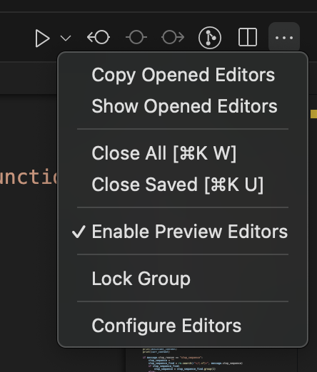

# ContextClip

ContextClip is a VS Code extension that helps you copy multiple files with their context, making it easier to share code with AI assistants.

## Features

- Copy multiple open files with a single command
- Preserves file paths and context
- Formats output in a way that's optimal for AI assistants
- Works across multiple tab groups
- All files selected by default for quick copying



## Usage

1. Click the "..." menu in your editor
2. Select "Copy Opened Editors"
3. Deselect any files you don't want to include
4. Press Enter to copy all selected files to clipboard
5. Paste into your favorite AI assistant!

## Output Format

Files are copied in the following format:

````
./path/to/file.ts

```typescript
// File contents here
```
````

This format works particularly well with AI assistants as it preserves file paths and syntax highlighting.

## Requirements

VS Code 1.80.0 or higher

## Extension Settings

This extension doesn't require any configuration.

## Known Issues

None at this time.

## Release Notes

### 0.0.1

Initial release of ContextClip

- Basic file copying functionality
- Multiple file selection
- Path preservation
